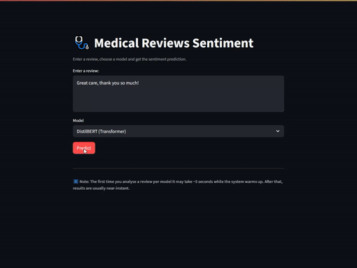
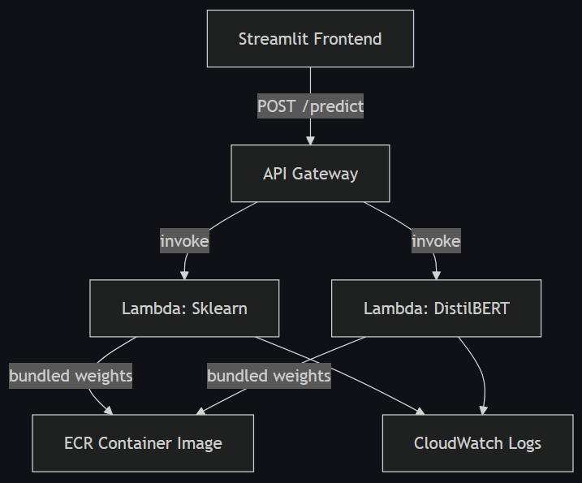

# 🏥 Sentiment Analysis on Google Reviews of US Medical Facilities

This project performs **binary sentiment classification** (positive / negative) trained on a dataset of ~233k [Google reviews for US medical facilities](https://www.kaggle.com/datasets/cgrowe96/google-reviews-of-us-medical-facilities). It demonstrates two modeling approaches, both deployed serverlessly to **AWS Lambda** and exposed via **API Gateway** with a [Streamlit frontend](https://medical-sentiment-analysis.streamlit.app/).

---

## ✨ Features

- **Two ML approaches**:
  - ✅ Baseline: TF-IDF + Logistic Regression (scikit-learn)
  - 🚀 Advanced: DistilBERT fine-tuned with Hugging Face Transformers
- **Streamlit Frontend**:
  - Google-style input box and model selector
  - Results panel showing sentiment, certainty % and time taken
- **Serverless Deployment**:
  - Packaged into AWS Lambda (Docker/ECR)
  - Secured with REST API keys
- **Monitoring & Cost Control**:
  - CloudWatch metrics and logs
  - Usage plans to throttle requests (100/day, 10/burst, 1/second)

You can learn more here: [METHODOLOGY.md](METHODOLOGY.md)

---

## 🚀 Streamlit App
Here’s the app in action 👇

Try it here:

---

## 🏗️ Architecture Flowchart

---

## 📂 Project Structure
<pre>
medical-sentiment-analysis/
│
├── data/                   # Samples of the original dataset and cleaned reviews
├── notebooks/              # Model training and evaluation code
├── distilbert_sentiment/   # Fine-tuned Hugging Face model (Colab output)
├── lambda/                 # Lambda deployment code
│   ├── lambda_sklearn/     # Logistic Regression TF-IDF
│   └── lambda_distilbert/  # DistilBERT inference with Docker
├── api_tests/              # Scripts for querying deployed APIs
├── models/                 # .pkl file from Sklearn model
├── scripts/                # Model evaluation and S3 model.safetensors download
├── streamlit_app/          # Streamlit app script and associated files
├── README.md
├── METHODOLOGY.md
├── LICENSE_DATA.txt        # ODbL v1.0 license
├── LICENSE_CODE.txt        # MIT license
└── requirements.txt        # Python dependencies

</pre>

---

## 📜 Data License
The dataset used in this project is from [Kaggle]("https://www.kaggle.com/datasets/cgrowe96/google-reviews-of-us-medical-facilities") and is licensed under the Open Data Commons Open Database License (ODbL) v1.0.
You must comply with its terms if you share or use the data.